<div align="center">



<br/>


<br/>

> **סוכן AI לתחזית מזג האוויר** — ישראל 🇮🇱 דרך שליטה בדפדפן אמיתי, ארה"ב 🇺🇸 דרך NWS API.  
> כתוב עם MCP SDK של Anthropic ו-Playwright של Microsoft.

</div>

---

## 📋 תוכן עניינים

- [🎯 על הפרויקט](#-על-הפרויקט)
- [🏗️ ארכיטקטורה](#%EF%B8%8F-ארכיטקטורה)
- [🛠️ סטאק טכנולוגי](#%EF%B8%8F-סטאק-טכנולוגי)
- [⚡ התקנה והרצה](#-התקנה-והרצה)
- [🔧 כלים זמינים](#-כלים-זמינים)
- [💬 דוגמאות שימוש](#-דוגמאות-שימוש)
- [📁 מבנה הפרויקט](#-מבנה-הפרויקט)
- [🎓 מה למדנו](#-מה-למדנו)

---

## 🎯 על הפרויקט

פרויקט זה ממש MCP Server מותאם אישית שמאפשר ל-Claude לגשת לתחזית מזג האוויר בישראל — **לא דרך API** אלא על ידי פתיחת דפדפן Chromium אמיתי, ניווט לאתר [weather2day.co.il](https://www.weather2day.co.il/forecast), חיפוש עיר, ושליפת התוכן — בדיוק כמו שמשתמש אנושי היה עושה.

### למה זה מעניין?

| גישה רגילה | הגישה שלנו |
|------------|------------|
| קריאה ל-API קיים | 🤖 שליטה בדפדפן אמיתי עם Playwright |
| JSON נקי ומסודר | 🕸️ Scraping + ניקוי תוכן עמוד |
| אין ויזואליזציה | 👀 רואים את הדפדפן עובד בזמן אמת |
| תמיד זמין | 🌍 פועל על **כל** אתר בעולם |

---

## 🏗️ ארכיטקטורה

```
┌─────────────────────────────────────────────────────────────┐
│                        host.py                               │
│              (Claude Opus 4.5 + Chat Loop)                   │
└──────────────────┬──────────────────────┬───────────────────┘
                   │                      │
       ┌───────────▼──────────┐  ┌────────▼─────────────┐
       │      client.py       │  │      client.py        │
       │   (MCP Client #1)    │  │   (MCP Client #2)     │
       └───────────┬──────────┘  └────────┬──────────────┘
                   │ stdio                │ stdio
       ┌───────────▼──────────┐  ┌────────▼──────────────┐
       │   weather_USA.py     │  │  weather_Israel.py    │
       │   (MCP Server)       │  │  (MCP Server)         │
       │                      │  │                       │
       │  🌐 NWS API          │  │  🌐 Playwright        │
       │  api.weather.gov     │  │  weather2day.co.il    │
       └──────────────────────┘  └───────────────────────┘
```

**זרימת בקשה ישראלית:**

```
User: "מה מזג האוויר בחיפה?"
         │
         ▼
    Claude מחליט להפעיל כלים
         │
         ├─► open_weather_forecast_israel()
         │      └─ פותח Chromium ← weather2day.co.il/forecast
         │
         ├─► enter_weather_forecast_city_israel("חיפה")
         │      └─ מקליד "חיפה" בשדה החיפוש
         │
         ├─► select_weather_forecast_city_israel()
         │      └─ לוחץ על הפריט הראשון ברשימה
         │
         ├─► get_weather_forecast_content_israel()
         │      └─ שולף ומנקה את תוכן הדף → RAG
         │
         ▼
    Claude קורא את התוכן ומנסח תשובה בשפת המשתמש
```

---

## 🛠️ סטאק טכנולוגי

<table>
<tr>
<td width="50%">

### 🤖 AI & Orchestration
| טכנולוגיה | תפקיד |
|-----------|--------|
| **Anthropic Claude** | מנוע ה-AI שמחליט אילו כלים לקרוא |
| **MCP SDK** | פרוטוקול התקשורת בין Claude לכלים |
| **FastMCP** | Decorator API לרישום Tools |

</td>
<td width="50%">

### 🌐 Browser & Data
| טכנולוגיה | תפקיד |
|-----------|--------|
| **Playwright** | אוטומציית דפדפן — פתיחה, ניווט, קליק |
| **Chromium** | הדפדפן שרץ מאחורי הקלעים |
| **httpx** | קריאות HTTP ל-NWS API (ארה"ב) |

</td>
</tr>
<tr>
<td>

### 🔌 Transport
| טכנולוגיה | תפקיד |
|-----------|--------|
| **stdio** | ערוץ התקשורת בין Host ל-MCP Servers |
| **AsyncExitStack** | ניהול lifecycle של חיבורים |

</td>
<td>

### ⚙️ Tooling
| טכנולוגיה | תפקיד |
|-----------|--------|
| **uv** | מנהל חבילות מהיר ב-Python |
| **python-dotenv** | טעינת `.env` עם ה-API key |

</td>
</tr>
</table>

---

## ⚡ התקנה והרצה

### דרישות מוקדמות
- Python 3.11+
- [uv](https://docs.astral.sh/uv/) מותקן
- מפתח [Anthropic API](https://console.anthropic.com)

### 1. שכפול הריפו

```bash
git clone https://github.com/Tamar-Winer/MCP_with_Playwright_MB.git
cd MCP_with_Playwright_MB
```

### 2. התקנת תלויות

```bash
uv sync
```

### 3. התקנת Chromium

```bash
uv run playwright install chromium
```

### 4. הגדרת ה-API Key

**אפשרות א׳ — קובץ `.env`** (מומלץ):
```bash
# צרי קובץ .env בתיקיית הפרויקט
ANTHROPIC_API_KEY=sk-ant-xxxxxxxxxxxxxxxx
```

**אפשרות ב׳ — משתנה סביבה:**
```powershell
# Windows PowerShell
$env:ANTHROPIC_API_KEY = "sk-ant-xxxxxxxxxxxxxxxx"
```

```bash
# macOS / Linux
export ANTHROPIC_API_KEY="sk-ant-xxxxxxxxxxxxxxxx"
```

### 5. הרצה

```bash
uv run host.py
```

---

## 🔧 כלים זמינים

### 🇮🇱 Israel Weather — `weather_Israel.py`

כלים אלה פועלים ברצף: כל כלי מכין את הקרקע לבא אחריו.

```
open → enter_city → select_city → get_content
```

<details>
<summary><strong>🟣 open_weather_forecast_israel</strong> — פתיחת דפדפן</summary>

```python
open_weather_forecast_israel() -> str
```
פותח חלון Chromium גלוי ומנווט לדף:  
`https://www.weather2day.co.il/forecast`

מחזיר אישור עם כותרת הדף.

</details>

<details>
<summary><strong>🟣 enter_weather_forecast_city_israel</strong> — הזנת עיר</summary>

```python
enter_weather_forecast_city_israel(city: str) -> str
```
מחפש שדה חיפוש בדף ומקליד את שם העיר.  
תומך בעברית ואנגלית: `"תל אביב"`, `"ירושלים"`, `"Tel Aviv"`.

</details>

<details>
<summary><strong>🟣 select_weather_forecast_city_israel</strong> — בחירה מהרשימה</summary>

```python
select_weather_forecast_city_israel() -> str
```
לוחץ על הפריט הראשון בתפריט ה-autocomplete.  
ממתין לטעינת דף התחזית ומחזיר את ה-URL החדש.

</details>

<details>
<summary><strong>🟣 get_weather_forecast_content_israel</strong> — שליפת תוכן (RAG)</summary>

```python
get_weather_forecast_content_israel() -> str
```
מחלץ את טקסט התחזית מהדף, מנקה רעש ניווט ופרסומות,  
ומחזיר עד 150 שורות של תוכן מקוצר ל-Claude.

</details>

---

### 🇺🇸 USA Weather — `weather_USA.py`

<details>
<summary><strong>🔵 get_weather_usa</strong> — תחזית לעיר אמריקאית</summary>

```python
get_weather_usa(city: str) -> str
```
קורא ל-[api.weather.gov](https://api.weather.gov) (ללא API key).  
מחזיר 4 פרקי תחזית עם טמפרטורה, רוח ותיאור מפורט.

**ערים נתמכות:**  
`New York`, `Los Angeles`, `Chicago`, `Houston`, `Miami`,  
`Seattle`, `Denver`, `Boston`, `San Francisco`, `Atlanta`,  
`Dallas`, `Phoenix`, `Washington`, `Las Vegas`, `Austin` ועוד.

</details>

---

## 💬 דוגמאות שימוש

הפעל עם `uv run host.py` ונסה את השאלות הבאות:

```
You: מה מזג האוויר היום בתל אביב?
```
> Claude יפתח דפדפן, יחפש "תל אביב", ויספר לך את התחזית 🌤️

```
You: האם יורד גשם בחיפה השבוע?
```

```
You: What's the forecast for Chicago tomorrow?
```

```
You: תשווה לי בין מזג האוויר בירושלים לבין ניו יורק
```
> Claude יפעיל גם את השרת הישראלי וגם את השרת האמריקאי! 🌍

```
You: כמה מעלות בבאר שבע?
```

```
You: Is it going to be hot in Miami this weekend?
```

---

## 📁 מבנה הפרויקט

```
📦 MCP_with_Playwright_MB/
│
├── 🐍 host.py              ← נקודת הכניסה — צ'אט טרמינל + Claude
├── 🐍 client.py            ← MCP Client גנרי (stdio transport)
│
├── 🐍 weather_Israel.py    ← MCP Server — ישראל דרך Playwright ⭐
├── 🐍 weather_USA.py       ← MCP Server — ארה"ב דרך NWS API
│
├── ⚙️  pyproject.toml      ← תלויות הפרויקט (uv)
├── 🔒 uv.lock              ← גרסאות קפואות
├── 🚫 .gitignore
│
├── 📁 assets/
│   └── 🖼️  banner.svg      ← אנימציית הכותרת
│
└── 📖 README.md
```

---

## 🎓 מה למדנו

<table>
<tr>
<td>

**🔌 MCP SDK**
- בניית MCP Server מאפס עם `FastMCP`
- רישום Tools עם decorators ו-type hints
- חיבור מרובה שרתים ל-Host אחד
- תקשורת stdio בין תהליכים

</td>
<td>

**🤖 Playwright**
- שליטה בדפדפן אמיתי דרך Python
- כתיבת סלקטורים חכמים עם fallbacks
- ניהול מצב (browser/page) בין קריאות כלים
- שליפת תוכן דף + ניקוי לצורכי RAG

</td>
</tr>
<tr>
<td>

**🧠 AI Agents**
- ניהול היסטוריית שיחה ב-Claude API
- לולאת tool_use ← tool_result
- system prompt להכוונת התנהגות
- RAG — העשרת הקונטקסט מתוכן חי

</td>
<td>

**⚙️ Python Async**
- `async/await` לכלים עם I/O
- `AsyncExitStack` לניהול lifecycle
- `AsyncAnthropic` לאי-חסימת event loop
- ניהול globals בין קריאות async

</td>
</tr>
</table>

---

<div align="center">

**פרויקט 4 | קורס Dovrot AI | 2025**


</div>
